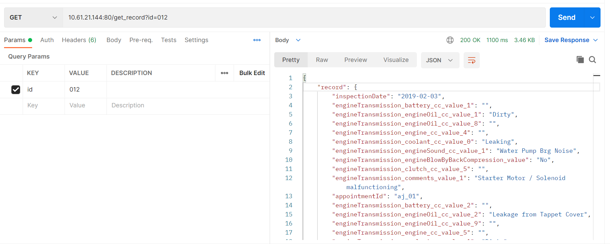

# FastAPI BlueYonder

Perform GET and POST operation on engine_inspection tables
Endpoint:
 - POST : hostname:port/upload_file/
 - GET: hostname:port/get_record?id=011

Assumption: Assuming the file is a csv file for POST. Thus I have converted given
sample xlsx file to csv file.

Sample file for POST API:
Available inside root folder.

### Steps to run:
1. Git clone the repo.
2. Ensure docker is installed and working.
3. From FastAPI_BlueYonder directory, do docker-compose up -d --build
4. docker-compose ps to check if services are running
 
5. Credentials for postgres
   - Username : postgres
   - password : postgres
   - DB : test_db
6. Logs are available for api server at /by/logs on host

## Project Structure
```
├── database
│   └── postgres
├── postgres-data
└── services
    ├── source
    │ ├── config
    │ ├── handlers
    │ ├── models
    │ └── schema
    └── unittest
        ├── testcase
        └── testdata

```
 - Config folder has the db related functions. 
 - Handlers are specific files to handle login for an endpoint.
 - Models stores the ORM model.
 - Schema has the pydantic models
 - Unittest has testcase and testdata.
 - Database can have database related scripts or configs, not used currently.

## Unittest and function testcases
1. Validate GET requests
2. Validate POST requests
3. Schema related validations
4. Duplicate data removed from the current file
5. Remove already existing data from the DB to avoid primary key issues.

#### Schema valdiations
1. inspectionDate is in req format
2. start time follows 24hr format. 
3. month, 0<month<13

Sample results:
 --- ---
1. GET request for available record:

--- ---
2. GET request for invalid file

--- ---
3. POST request for valid file

Logs:
```
2022-07-06 18:56:09,072 :INFO :engine_inspection.py[post_engine_inspection]: 151: Schema validated and deduplicated records in 0.01sec.
2022-07-06 18:56:09,080 :INFO :engine_inspection.py[drop_already_existing_records]: 121: Removed already existing records in 0.01sec.
2022-07-06 18:56:09,286 :INFO :engine_inspection.py[post_engine_inspection]: 168: Inserted 2 records in 0.21sec.
```
--- ---
4. For already existing records


5. For 26k records


Further improvements:
1. Seperating sql from ORM to init script in database.
2. Adding more validations to the input body.
